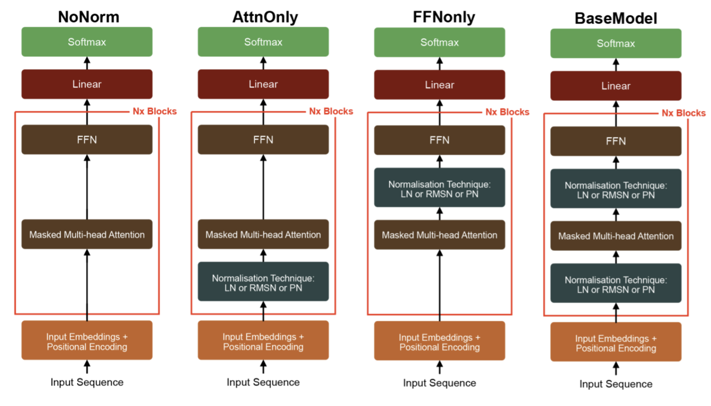

# GPT-Foundations

Character-level language models and byte-pair tokenizers, built with Python and PyTorch.

This project records my study of Transformer models and tokenization in July 2024. It follows Andrej Karpathy’s lectures and includes my own tokenizer experiments.

The work progresses from a bigram model to a **10.79-million-parameter Transformer**. Separate notebooks explore byte-pair encoding, regular expressions, and tokenizer design.

This project formed the foundation for my later GPT-2 reproduction and normalization research.

**Former repository name:** `GPT-dev - Andrej`

[Model on Hugging Face](https://huggingface.co/shng2025/gpt-dev__andrej-course) · [Main model](gpt.py) · [Main experiment notebook](GPT-dev%20%3D%20Build%20from%20scratch%20%28v2%29.ipynb) · [Related projects](#related-projects)

## Recorded results

The main notebook contains a complete training log for a character-level model on Tiny Shakespeare.

| Item | Recorded value |
|---|---:|
| Model parameters | 10,788,929 |
| Transformer blocks | 6 |
| Attention heads per block | 6 |
| Embedding dimension | 384 |
| Context length | 256 characters |
| Batch size | 64 |
| Training iterations | 10,000 |
| Lowest recorded validation loss | 1.4849 |
| Step with the lowest recorded validation loss | 3,000 |
| Long text-generation example | 10,000 additional characters |

The losses below are next-character cross-entropy values.

| Step | Training loss | Validation loss |
|---:|---:|---:|
| 0 | 4.2221 | 4.2306 |
| 3,000 | 1.0694 | **1.4849** |
| 9,999 | **0.4333** | 1.9475 |

Training loss continued to decrease after step 3,000. Validation loss increased over the rest of the run. This pattern shows overfitting in this experiment.

These values come from the saved notebook outputs. The standalone `gpt.py` script defaults to 5,000 iterations.

## Project scope

The repository contains three main parts.

| Part | Purpose | Main files |
|---|---|---|
| Bigram language model | Establish a simple next-character baseline | `bigram.py` |
| Transformer language model | Study causal attention and autoregressive text generation | `gpt.py` and model notebooks |
| Tokenizer experiments | Study byte-pair encoding and text segmentation | Tokenizer notebooks |

The language models use a **character-level tokenizer**.

The byte-pair tokenizer experiments are separate. The model scripts do not use those tokenizers.

## Character-level Transformer

### Architecture

The model uses a decoder-only Transformer.

For each input character, the model adds a token embedding to a learned position embedding. Six Transformer blocks process the sequence.

Each block contains:

1. Layer normalization.
2. Causal multi-head self-attention.
3. A residual connection.
4. Layer normalization.
5. A feed-forward network.
6. A second residual connection.

A final layer normalization precedes the output projection. The output projection produces one logit for each character in the vocabulary.

The token embedding and output projection use separate weights.

### Causal attention

Each attention head has separate query, key, and value projections.

The implementation computes attention scores from queries and keys. It scales these scores by the inverse square root of the head dimension.

A triangular mask prevents access to future positions. Softmax converts the masked scores into attention weights.

Each head computes a weighted sum of the value vectors. The model concatenates the head outputs and applies an output projection.

This implementation exposes the attention operations directly through PyTorch tensor operations.

### Feed-forward network

The feed-forward network processes each sequence position separately.

Its dimensions are:

```text
384 → 1,536 → 384
```

The network uses a ReLU activation between its linear layers. Dropout follows the second linear layer.

### Default configuration

| Setting | Value |
|---|---|
| Embedding dimension | 384 |
| Attention heads | 6 |
| Dimension per head | 64 |
| Transformer blocks | 6 |
| Context length | 256 |
| Batch size | 64 |
| Dropout | 0.2 |
| Optimizer | AdamW |
| Learning rate | 0.0003 |
| Evaluation interval | 500 steps |
| Evaluation batches per split | 200 |
| Random seed | 1337 |
| Script training iterations | 5,000 |
| Main notebook training iterations | 10,000 |

### Data preparation

The model reads `input.txt` from the current directory.

It creates a vocabulary from the sorted set of characters in the text. Each character receives an integer ID.

The first 90% of the token sequence forms the training split. The final 10% forms the validation split.

The batch loader selects random sequence offsets. Each target sequence starts one character after its input sequence.

```text
Input:   characters at positions t     through t + 255
Target:  characters at positions t + 1 through t + 256
```

The model learns to predict the next character at every position.

### Training and evaluation

The training loop computes cross-entropy loss and updates the model with AdamW.

At each evaluation interval, the code:

1. Switches the model to evaluation mode.
2. Disables gradient calculation.
3. Evaluates 200 batches from each split.
4. Reports the mean training and validation losses.
5. Restores training mode.

### Text generation

The model generates text one character at a time.

At each step, it uses the latest 256 characters as context. It converts the final-position logits into probabilities and samples the next character.

The standalone script generates 500 additional characters after training.

The main notebook also contains a saved 10,000-character generation example.

## Bigram baseline

The bigram model predicts the next character from the current character.

Its embedding table maps each character directly to vocabulary logits. It has no attention layers.

Although the batch loader supplies sequences, each prediction depends only on the character at that position.

| Setting | Value |
|---|---|
| Batch size | 32 |
| Sequence length per batch item | 8 |
| Training iterations | 30,000 |
| Learning rate | 0.01 |
| Optimizer | AdamW |
| Evaluation interval | 3,000 steps |
| Evaluation batches per split | 200 |
| Generated characters | 500 |

This baseline provides a simple reference for the Transformer model.

## Tokenizer development

The tokenizer notebooks record several stages of development.

### Initial vocabulary experiments

The first personal notebook explores vocabulary construction before the later byte-level implementation.

It contains:

- A tokenizer class scaffold.
- Character vocabulary construction.
- Token-frequency counts.
- Adjacent-token and n-gram counts.
- Vocabulary expansion experiments.
- Longest-match token lookup.

This notebook preserves intermediate prototypes. Some cells contain incomplete implementations.

Read it as a development record rather than a finished tokenizer library.

[Open the initial tokenizer notebook](GPT-dev%20-%20Tokenizer%20%5Bpersonal%20implementation%5D%20%28base%20tokenizer%29.ipynb)

### Byte-pair encoding

The follow-along notebook develops byte-pair encoding from UTF-8 bytes.

The basic procedure is:

1. Convert the text into UTF-8 bytes.
2. Count adjacent token pairs.
3. Select the most frequent pair.
4. Assign a new token ID to that pair.
5. Replace occurrences of the pair.
6. Repeat until the vocabulary reaches the target size.

The initial vocabulary contains 256 byte values. Each merge adds one token.

The notebook also implements encoding and decoding. The decoder reconstructs the byte sequence from token IDs.

[Open the follow-along notebook](GPT-dev%20-%20Tokenizer%20%28Follow%20Along%29.ipynb)

### Personal tokenizer with regular expressions

The second personal notebook adds regular-expression segmentation before byte-pair encoding.

It uses a GPT-4-style split pattern to separate text into pieces. Each piece becomes a sequence of UTF-8 bytes.

The tokenizer counts pairs across these pieces. Each merge operates within a piece, so tokens do not cross the initial split boundaries.

The notebook configures:

| Setting | Value |
|---|---|
| Initial vocabulary | 256 byte tokens |
| Target vocabulary | 10,000 tokens |
| Merge operations | 9,744 |
| Text segmentation | Regular expressions |
| Token representation | Integer IDs |
| Decoding | Byte reconstruction followed by UTF-8 decoding |

The encoder applies learned merges in merge-rank order.

A saved example reconstructs the original text:

```python
decode(encode("hello world"))
```

```text
'hello world'
```

This tokenizer learns its own merge table and vocabulary. The regular-expression pattern alone does not make it equivalent to a released GPT-4 tokenizer.

[Open the personal tokenizer with regex](GPT-dev%20-%20Tokenizer%20%5Bpersonal%20implementation%5D%20V2%20%2B%20regex.ipynb)

### Additional tokenizer studies

The follow-along notebook also covers:

- Unicode and UTF-8.
- Multibyte characters and emoji.
- GPT-2 text segmentation.
- GPT-2 vocabulary and merge-file inspection.
- Whitespace behavior in `gpt2` and `cl100k_base`.
- Encode/decode examples with `tiktoken`.
- A SentencePiece BPE configuration.
- Byte fallback and special-token settings.

These exercises connect the basic merge algorithm to existing tokenizer tools.

## Run the language models

### Create an environment

The notebooks record PyTorch 2.3.0. The example below uses that version with Python 3.10.

Run these commands from the repository directory:

```bash
python3.10 -m venv .venv
source .venv/bin/activate

python -m pip install torch==2.3.0
```

Both model scripts select CUDA when PyTorch reports an available CUDA device. Otherwise, they use the CPU.

The scripts do not select Apple Metal through `mps`.

### Download Tiny Shakespeare

The repository does not include `input.txt`.

Download the corpus into the repository directory:

```bash
curl -L --fail \
  https://raw.githubusercontent.com/karpathy/char-rnn/master/data/tinyshakespeare/input.txt \
  -o input.txt
```

### Run the bigram model

```bash
python bigram.py
```

### Run the Transformer

```bash
python gpt.py
```

Each script trains its model and then prints generated text.

To change a training setting, edit its value near the top of the script. The scripts do not provide command-line configuration options.

The scripts do not save checkpoints automatically.

## Use the notebooks

Install the additional tools:

```bash
python -m pip install jupyter regex "tiktoken==0.7.0" sentencepiece
```

Start Jupyter from the repository directory:

```bash
jupyter notebook
```

Use the main model notebook for the recorded Transformer experiment.

Use the tokenizer notebooks to inspect the individual experiments. Some notebooks preserve intermediate code, so select the cells for the experiment you need.

### Tokenizer text corpus

The personal tokenizer notebooks refer to `taylorswift.txt`.

Download the raw text with:

```bash
curl -L --fail \
  https://raw.githubusercontent.com/karpathy/minbpe/master/tests/taylorswift.txt \
  -o taylorswift.txt
```

Skip the original download cell in those notebooks. Its GitHub `blob` URL returns an HTML page rather than the raw text.

The GPT-2 vocabulary inspection cells also expect `encoder.json` and `vocab.bpe`. The repository does not include these files.

## Model archive

The project links to a model archive on Hugging Face:

[shng2025/gpt-dev__andrej-course](https://huggingface.co/shng2025/gpt-dev__andrej-course)

The main notebook includes this export cell:

```python
torch.save(model, "full_model.pth")
```

This operation saves the custom PyTorch model object.

To reuse that format, retain the model class definitions and the original character mapping. The notebook defines both.

The model uses the project’s custom implementation rather than a Hugging Face Transformers model class.

## Repository guide

| File or directory | Contents |
|---|---|
| [`gpt.py`](gpt.py) | Standalone character-level Transformer |
| [`bigram.py`](bigram.py) | Standalone bigram model |
| [`GPT-dev = Build from scratch.ipynb`](GPT-dev%20%3D%20Build%20from%20scratch.ipynb) | Model development and component experiments |
| [`GPT-dev = Build from scratch (v2).ipynb`](GPT-dev%20%3D%20Build%20from%20scratch%20%28v2%29.ipynb) | Main model, saved training log, and generated text |
| [`GPT-dev - Tokenizer (Follow Along).ipynb`](GPT-dev%20-%20Tokenizer%20%28Follow%20Along%29.ipynb) | Byte-level BPE and tokenizer tool studies |
| [`Personal base tokenizer notebook`](GPT-dev%20-%20Tokenizer%20%5Bpersonal%20implementation%5D%20%28base%20tokenizer%29.ipynb) | Initial vocabulary and token-merge prototypes |
| [`Personal tokenizer V2 + regex`](GPT-dev%20-%20Tokenizer%20%5Bpersonal%20implementation%5D%20V2%20%2B%20regex.ipynb) | Byte-level BPE with regex segmentation |
| [`Original/`](Original/) | Reference model notebook |
| [`Original - Tokenizer/`](Original%20-%20Tokenizer/) | Reference tokenizer notebook |
| [`Notes links.md`](Notes%20links.md) | Model study-note links |
| [`Notes links - Tokenizer.md`](Notes%20links%20-%20Tokenizer.md) | Tokenizer study-note links |
| [`docs/images/`](docs/images/) | Figures from the later GPT-Valkyrie study |

## Papers studied

The repository includes copies of three papers:

- [Attention Is All You Need](Attention%20is%20All%20you%20need1706.03762v7.pdf)
- [Language Models are Unsupervised Multitask Learners](language_models_are_unsupervised_multitask_learners.pdf)
- [Efficient Training of Language Models to Fill in the Middle](2207.14255v1.pdf)

These papers provide context for the model and tokenizer studies. The repository does not implement every method from these papers.

## Later research: GPT-Valkyrie

This project led to GPT-2 reproduction work and then GPT-Valkyrie.

GPT-Valkyrie studies normalization methods and their positions within Transformer blocks.

The figures below come from that later research project. They describe its experiments and results.

### Normalization ablations



The diagram compares four normalization layouts:

- `NoNorm`
- `AttnOnly`
- `FFNonly`
- `BaseModel`

These layouts define the later ablation study.

### BillSum loss curves


The plot shows loss curves from the BillSum fine-tuning experiments.

Read the paper for the experimental setup and interpretation:

- [Research paper on GitHub](https://github.com/Ice-Citron/GPT-Valkyrie/blob/main/Extended%20Essay%20-%20Transformers.pdf)
- [Research paper on Google Drive](https://drive.google.com/file/d/1dlhTgv4-A2cCYSsL00An_XpfGpg1DyWy/view)
- [GPT-Valkyrie model checkpoints](https://github.com/Ice-Citron/GPT-Valkyrie#model-checkpoints)

## Related projects

| Repository | Focus |
|---|---|
| [GPT-Foundations](https://github.com/Ice-Citron/GPT-Foundations) | Character-level models and tokenizer development |
| [GPT2-Reproduction](https://github.com/Ice-Citron/GPT2-Reproduction) | GPT-2 reproduction and distributed training |
| [GPTesla-Code-Generation](https://github.com/Ice-Citron/GPTesla-Code-Generation) | Code-generation experiments |
| [GPT-Valkyrie](https://github.com/Ice-Citron/GPT-Valkyrie) | Transformer normalization research |

## Acknowledgements

This project follows Andrej Karpathy’s educational work.

The main lectures are:

- **Let's build GPT: from scratch, in code, spelled out.**
- **Let's build the GPT Tokenizer.**

Both lectures appear in [Neural Networks: Zero to Hero](https://karpathy.ai/zero-to-hero.html).

The model scripts and follow-along notebooks use these lectures as their foundation. The personal tokenizer notebooks record my additional implementation attempts and experiments.

Karpathy’s [minbpe](https://github.com/karpathy/minbpe) repository provides a reference for byte-level BPE and the tokenizer text corpus.

## License

This repository includes an [MIT license](LICENSE).

Copyright © 2024 Shi Hao.
